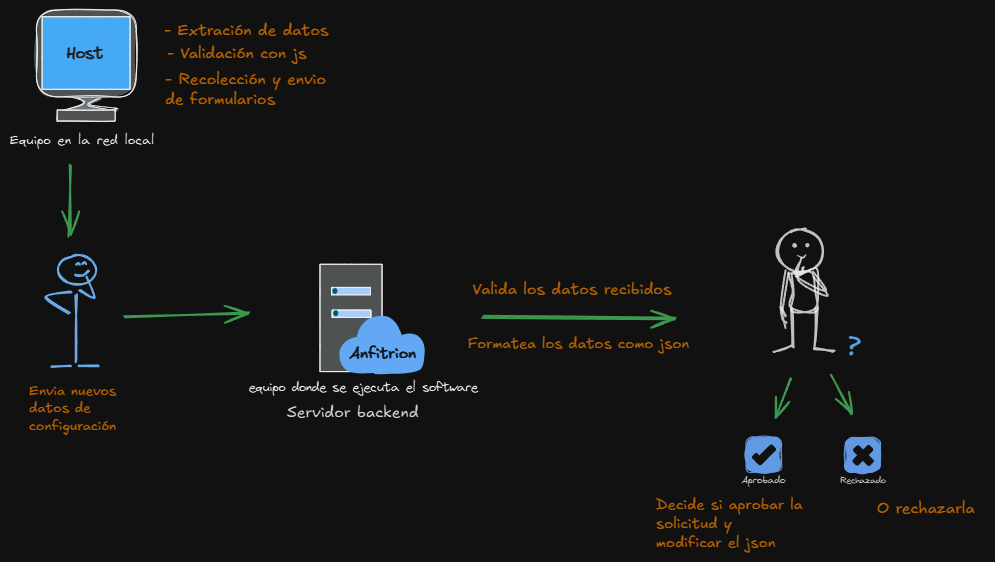

# Documentación
Este archivo contiene informaciones técnicas sobre el funcionamiento de VA y la explicación de partes puntuales de su código, así como los parametros que reciben algunas funciones.

***

### Proyecto VA
Dicho de manera simple, el asistente virtual o proyecto VA se adapta a la siguiente estructura para lograr su cometido:

1. Grabar voz del usuario 🎤 (SpeechRecognition)
1. Convertir lo que dijo en texto 🖋 (Google / Whisper)
1. Procesar la intención del usuario ❓ (modelo de IA - gpt)
1. Ejecutar la acción deseada 👨‍🏭
1. Preparar respuesta (en texto) 💬
1. Convertir en audio y reproducir 🦻 (pyttsx3 - azure SS)

***
## Asistente local

### Va
La programación de VA (Virtual Assistant) gira en torno a la petición y respuesta, o retorno de respuestas como consecuencia de repetidas peticiones entre el usuario y el asistente. Para esto se crearon distintos módulos y funciones que ayudan al óptimo desarrollo de su finalidad.

**listen()** -> Esta función se encarga de utilizar los modulos de SpeechRecognition para escuchar al usuario apoyandose en el microfono del equipo host, luego retorna la transcripción de lo que el usuario dijo en texto.

**Ejemplo de código:**
```python
voz_a_text = listen()
```

**talk(text):** -> Esta funcion recibe un texto y lo reproduce de manera audible, para esto utiliza el modulo de pyttsx3 que es gratuito o bien la api de azure speech service que aunque es de paga es la recomendada por el desarrollador.

**Ejemplo de código**
```python
talk("Mi nombre es Jarvis")
```

va.py es el archivo principal y es donde se centralizado todo el código, en este archivo se encuentra la estructura **Match-case** de python, similar a los swith-case de otros lenguajes de programación y la funcion **run_gpt** por destacar algunas de las partes más importantes de este archivo.

En el inicio del archivo va.py se encuentran las importaciones, muchos de los modulos necesarios se colocan en el principio del archivo para una unica importación y a partir de ahí una ejecución continua, además, tambien se importan funciones de otros modulos locales con la finalidad de mantener el código del archivo principal lo más limpio posible.

**run_gpt(text)** -> Esta función recibe un texto como parametro y su trabajo es hacerle una petición al modelo de gpt especificado en el archivo config.json con el texto que se le pasa como argumento, además de asignarle un rol, una postura al asistente para maximizar su enfoque en algún tema especifico, una vez que se procesa la petición se retorna la respuesta que es posteriormente reproducida oralmente por el asistente.

**Ejemplo en código:**
```python
respuesta_de_gpt = run_gpt("Cuál es la diferencia entre comunismo y capitalismo")
```

**run({text, status})** -> Recibe dos parametros y es la función principal, dentro de esta se encuentra la estructura Match-case. El parametro text es el texto obtenido por la función listen() que contiene lo que el usuario dijo y el parametro status es un booleano que sirve para comprobar si el usuario menciono el nombre del asistente y actuar en consecuencia, si el usuario menciono el nombre del asistente significa que el usuario quiero alguna interacción y la función run ejecuta la petición, en cambio si es false, el usuario no ha dicho el nombre del asistente y por tanto se ignorara el fragmento de audio obtenido.

**Nota:** La función run tambien es capaz de recibir el parametro text escrito, el parametro status tomara el valor de True por defecto, ejemplo:

```python
# El asistente pedira a la función listen el texto a evaluar
run()

# El asistente evaluara automáticamente el texto que fue proporcionado
run('Cuentame un chiste')
```

**Match-case** -> Esta estructura de control de considerable longitud se encarga de realizar algunas acciones pre-programadas del asistente, por ejemplo, la inteligencia artificial quizas no pueda decir la hora actual o reproducir un video de youtube, es por ello que se evalua si una o varias palabras claves estan en el texto y actuar en consecuencia, ejemplo:

**Ejemplo en pseudocódigo:**
*Si "Hola" esta dentro de lo que el usuario dijo, entonces:*
    *Habla: "Saluda al usuario"*

### Banner
Este módulo tiene la unica tarea de imprimir un banner en consola, en este caso se utiliza para imprimir el banner de la promoción de informática que inicio este proyecto. Cuenta con la función figlet_banner que a su vez utiliza el módulo figlet para el arte ASCII, la función figlet_baner recibe los siguientes parametros: text, color, banner_index, bold, font_width, align.

text -> Texto que se quiero convertir a arte ASCII
color -> Color en el que se imprime el texto (recibe valores de escape. ASCII).
banner_index -> El modulo incluye una méticulosa selección de 24 fuentes, este valor especifica cual de ellas se quiere utilizar.
bold -> Es un booleano y especifica si se quiere el banner en negrita o no.
font_width -> Especifica el ancho disponible para imprimir la fuente.
align -> Es de tipo número y especifica la alineación de texto.

**Ejemplo de código:**
```python
figlet_banner(text:str = 'PROM2023-2024', color:str = "\033[93m", banner_index:int = 0, bold:bool = True, font_width:int = 140, align:str = 'center'):
```

**Nota:** Todos los parametros son opcionales por lo que se le pueden pasar solo los deseados o ninguno

### Days
Este módulo almacena la lógica de programación para calcular que dia fue hace x días atras, en escencia toma el dia actual y le resta el tiempo especificado por el usuario. El resultado de este modulo es en ingles, por lo que si se quiere la respuesta en español se utilizan 2 archivos txt que estan en la carpeta txt con los días en ingles y español al igual que los meses para realizar la traducción correcta apoyandose en el indice de la palabra a traducir en ambos archivos.

Contiene la función getDaysAgo para obtener los dias en el pasado y la función getDaysAhead para obtener una fecha en el futuro, ambas funciones recibe la transcripción de lo que dijo el usuario e interan sobre el texto buscando un número, este valor sera la cantidad de días que se desean obtener en el pasado o el futuro

**Ejemplo de código**
```python
getDaysAhead('que día sera en 5 días')

# La función iterara sobre la entrada y cuando encuentre el valor 5 lo convertira a float y lo sumara con la fecha actual, es el mismo principio para la función contraria.

getDaysAgo('que día fue hace 5 días')
```
### Report
Este módulo utiliza los módulos de pandas y openxl para leer un archivo .xlsx, es decir, un archivo de excel con un formato muy especifico, procesarlo y crear un archivo .xlsx procesado con los datos obtenidos del archivo de excel original.

Es especialmente util para crear reportes y gráficos de archivos de excel que varian solo en número y no en formato como lo pueden ser los archivos de excel que muestran el rendimiento mensual de la empresa con datos sobre cuanto dinero entra y sale.

Este archivo cuenta con la función create_report que a su vez recibe los siguiente parametros: archive_path, file_name, sheet_name, processed_file.

archive_path -> Recibe la ruta donde estan los archivos de excel a procesar.
file_name -> Recibe el nombre del archivo de excel que se quiere procesar.
sheet_name -> Un libro de excel puede tener varias hojas, este parametro le especifica con cual de ellas queremos trabajar.
processed_file -> Recibe el nombre del archivo procesado.

Al final la función retorna True si todo salio bien o le informa al usuario que cierre el archivo si lo tiene abierto puesto que dos programas no pueden utilizar el mismo archivo al mismo tiempo.

**Ejemplo de código:**

```python
# Se puede utilizar sin parametros porque todos ellos son opcionales
result = create_report()
print(result)

# O bien se le pueden pasar los parametros de interes
result = create_report(archive_path:str='excel\\', file_name:str = 'supermarket_sales.xlsx', sheet_name:str = 'Report', processed_file:str = 'sales.xlsx'):
print(result)
```

### Transfer_data
En etapas tempranas del desarrollo surgio la constante necesidad de interactuar con distintos archivos de texto para pedir y almacenar información, para mantener el código limpio se creo el módulo transfer_data para manipular los datos que se transfieren entre un archivo y otro, aunque actualmente el número de funciones es reducido gracias a la nueva forma centralizada de almacenar información en un archivo .json, estas son algunas de las funciones que incluye este módulo:

```python
test_colors()
# Se encarga de probar algunos códigos ASCII de cólores, su función es mostrar como se ven en consola permitiendo a los desarrolladores escoger el más adecuado dependiendo de cada situación (es más estetico que util).

read_config_file()
# Esta función lee el archivo .json con la mayor parte de la configuración del asistente y devuelve un diccionario con todos los datos extraidos para poder destructurarlo y repartir cada valor entre cada función del asistente, este cambio añadio una eficacia incomensurable y el desarrollo de una interfaz gráfica para manejar la configuración del asistente de manera sencilla.

internet = check_internet_connection()
print(internet) # True / False
# Se encarga de revisar que haya conexión a internet antes de cargar todos los módulos necesarios puesto que el assitente necesita conexión a internet para funcionar.

numero = letras_a_numero('cuatro')
print(numero) # 4
# Esta función se encarga exclusivamente de convertir de números en letras a números en formato númerico desde el cero hasta el 32 para el módulo de wake on lan, actualmente presenta el problema de que su capacidad es limitada y aunque se aumente la cantidad de números que puede transformar esto solo aumentara su coste de recursos disminuyendo a su vez la eficiencia.
```

### Voice_synthesizer
Este módulo se encarga de implementar el sintetizador de voz de Microsoft Azure Speech Services para mejorar considerablemente la calidad auditiva del asistente permitiendo escoger una voz entre cientos de ellas con disitntos idiomas y acentos.

**Nota:** puedes dedicarle unos minutos a ver la [página de microsoft](https://learn.microsoft.com/es-es/azure/ai-services/speech-service/language-support?tabs=tts) donde encontraras distintas voces e idiomas en caso de que decidas utilizar el motor de voz de Microsoft

Este módulo cuenta con solo una función llamada synthesize_to_speaker con los siguientes parametros: text, voice, recognition_language, azure_api_key, region.

text -> Recibe el texto que va a reproducir.
voice -> Se trata del idioma, la voz y el acento que prefiere el usuario, por defecto es es-MX-DaliaNeural .
recognition_language -> Recibe el lenguage que espera convertir a voz.
azure_api_key -> Recibe la clave API de Azure Speech Service para utilizar su API.
region -> Recibe la región en la que se configuro la cuenta para la clave api de azure SS.

**Nota:** se puede cambiar el argumento voice dentro de la función talk donde se invoca a la función synthesize_to_speaker que se menciona más arriba.

**Ejemplo de código:**
```python
synthesize_to_speaker(text:str='Hola mundo!', voice:str='es-MX-DaliaNeural', recognition_language:str='es-MX', azure_api_key:str= "AZURE_API_KEY", region:str='eastus')

# Todos los parametros de esta función son opcionales por lo que se posible pasar solo los de interes o ninguno
synthesize_to_speaker('Ha pasado mucho tiempo, ella mereces algo mejor, pero la vi con otra persona… y nunca me he sentido peor.')

# O bien especificar los parametros de interes si no se utilizaran en orden
synthesize_to_speaker(text='Soy Luisito Comunica', voice='es-CO-SalomeNeural', azure_api_key='misx-fsxd...')
```

### whisperBeta
Este módulo aún se encuentra en fase beta puesto que utiliza el hardware del equipo que ejecuta el software para convertir el audio a texto y por falta de un buen hardware el uso de este módulo se puede ver comprometido.

Este módulo incluye 2 funciones listen y recognize_audio necesitando esta última 2 parametros descritos a continuación:

```python
listen()
# -> Esta función utiliza SpeechRecognition para escuchar la voz del usuario y guarda la grabación en un archivo temporal en formato wav que luego utilizara la siguiente función:

recognize_audio(save_path, model)
# save_path corresponde al archivo de audio temporal devuelto por la función listen(), este archivo tendra el mismo nombre siempre por lo que se reescribira continuamente evitando ocupar demasiado espacio, el segundo parametro es el modelo de whisper que se quiere utilizar https://github.com/openai/whisper aqui hay más información sobre los modelos además de algunos ejemplos de código
```

## Interfaz web
ruta: dev/web/

### config.json
Este archivo contiene toda la configuración del asistente de manera centralizada y organizada, el formato json fue elegido por su facilida de lectura para los humanos y su versatilidad y popular uso en el desarrollo web. Este archivo se divide en 4 objetos principales:

assistant -> Este objeto contiene las opciones de configuración que directamente modifican el comportamiento del asistente, como el nombre, el idioma y el formato que de hora que utilizara.

```json
"assistant": {
    "name": "jarvis",
    "language": "es-ES",
    "hourFormat": "%I:%M %p",
    "voiceNumber": "2",
}
```

env -> Este objeto almacena información para la configuración del entorno que debe manejarse con cierta discreción tales como claves API, frases de encryptado y contraseñas.

```json
"env": {
    "voiceEngine": "pyttsx3",
    "encryption_phrase": "fresas",
    "azureApiKey": "",
    "openaiApiKey": "sk-khst...",
}
```

modules -> Este objeto contiene el nombre de todos los módulos del asistente además de un valor booleano que puede ser true o false para indicar si el asistente utilizara ese módulo o no.

```json
"modules": {
    "playYtContent": true,
    "searchInWeb": false,
    "infoInWeb": true,
    "reminders": false,
}
```

wakeonlan -> Este objeto contiene otro objeto mac dentro que a su vez contiene otros objetos con las direcciones MAC y direcciones IP de todos los equipos en la red local hasta un maximo de 32 equipos. Este objeto tiene el siguiente formato:

```json
"wakeonlan": {
    "mac": {
        "pc1": {
            "name": "chucho",
            "ip": "192.168.0.17",
            "mac": "DC-EA-UE-80-EC-7B",
            "status": true
        },
        "pc2": {
            "name": "pc2",
            "ip": "",
            "mac": "E8-9A-F3-N4-1G-6F",
            "status": true
        },
        "pc3": {
            "name": "boberto",
            "ip": "",
            "mac": "",
            "status": false
        }
    }
}
```

Donde el nombre de los objetos dentro de mac corresponde al indice y los objetos dentro de estos corresponden a un equipo wol en la red local, el valor de la ip es opcional, pero la dirección mac, el nombre y el status es obligatorio si se quieren enviar paquetes wol a un equipo. el valor de **status** va a depender del valor de la propiedad mac, de modo que si existe una dirección mac, status sera true, si no hay una dirección mac, status sera false.

### main.js
Este archivo se encarga de añadir funcionalidad al sitio web, abre y cierra los modals, actualiza información recolecta, unifica y envia la información de los distitnos formularios en la pagina de configuración y en general tiene funciones de validación, funcionalidad y estetica. Además este archivo tambien es el responsable de hacer una petición a una URL local y rellenar los datos de la pagina web con los datos actuales del archivo json de configuración.

### htaccess
Controla el comportamiento del sitio web del lado del servidor / backend además de controlar comportamientos de visualización de la URL y la politica de CORDS para poder realizar peticiones y envios entre distintas URL's.

[](assets/exdw-documentation.png)

### apply.php
Controla el recibo y la validación de la información enviada por el cliente y posteriormente crear un archivo php completo con la nueva información, de modo que incluso si se modifica un solo valor, php creara un archivo php completo con el mismo nombre reescribiendo el contenido del anterior.

```php
// Como las API REST trabajan con json se formatean las cabeceras del archivo php que entienda el formato
header('Content-Type: application/json; charset=utf-8');
if ($_SERVER['REQUEST_METHOD'] === 'POST') { // Los datos se envian por el método post
    $data = json_decode(file_get_contents('php://input'), true);

    // Si name es null o no tiene valor obtendra el valor de '' por defecto (??)
    $name = htmlspecialchars(trim($data['assistant']['name'] ?? ''));
    
    if (!empty($name)) { // Si el nombre es distinto de vacio
        $response = [
            "status" => "success",
            'ok' => true,
            "code" => 200,
            "message" => "Operation was completed successfully.",
            "data"=> $data,
            'timestamp' => date('c'), // Marca de tiempo en formato ISO 8601
            "errors" => null
        ];
    } else {
        $response = [
            'status' => 'error',
            'ok' => false,
            'code' => 400,
            'message' => "name field can't be empty.",
            'data' => null,
            'errors' => [
                'Data was received, but there is an issue in the data'
            ]
        ];
    }
    // convierte el array asociativo a un json y la envia a javascript como respuesta
    echo json_encode($response);
    
    // Enviar los datos en formato json al archivo config.json
    $json_for_humans = json_encode($data, JSON_PRETTY_PRINT | JSON_UNESCAPED_SLASHES | JSON_UNESCAPED_UNICODE);
    file_put_contents('assets/config.json', $json_for_humans);
}
```

### configuration.php
Es una simple página web que sirve para solicitar los datos de configuración del asistente y utiliza php para importar distintas partes de la pagina y así mantener cada sub-pagina más limpia limitandose al contenido que va a proveer dicha pagina.

### header.php
Es simple código html en un archivo php para ser posteriormente incluido en cada uno de los submenus con una simple linea de php.

```php
include 'imports.php'
```

De esta manera al modificar solo 1 archivo se cambia el menu en todas las paginas.

### imports.php
Tiene la misma función que el archivo de **header.php**, pero en este caso se utiliza para importar los archivos necesarios para la funcionalidad de la página web.

### index.php
Este es el archivo principal y se encarga de suplir una página de incio, aunque la página web tiene fines meramente de configuración, para añadir algo de escencia a la web se utiliza este archivo para mostrar algunas informaciones del equipo que ejecuta el asistente.

### modals.php
En resumdas cuentas, este archivo contiene todos los modales o ventanas modal para dejar saber alguna información o solicitar otras al usuario.