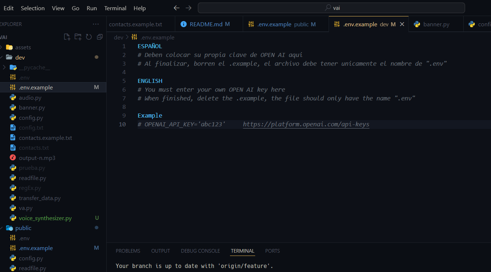
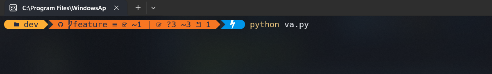

<h1 align="center">
    
</h1>
<div align="center"> 
  <a href="https://www.instagram.com/informaticade_6to?igsh=MjJycm12bXZpbjk4">
    
  </a>
</div>


<h1 align="center">PROYECTO VA</h1>

El proyecto VA será un asistente virtual potenciado con IA con la capacidad de cambiar el nombre de llamada por uno cómodo para el usuario. VA será desarrollado inicialmente en Python y tendrá la capacidad de ejecutarse en todos los sistemas operativos. Su objetivo principal será el de ofrecer información y ayudar con tareas ambiguas al usuario.

***

## Consideraciones Técnicas
([**Curso de Python**](https://youtu.be/nKPbfIU442g?si=MVQuPnEONV21Q0fM))   
([**Curso de GIT**](https://youtu.be/3GymExBkKjE?si=LCoZB_32ZzKhNZD5))  
([**Curso de Python (opcional)**](https://www.youtube.com/playlist?list=PLJ7sTTLrIA6m2bGromPVNC52slexHVJfe))   
([**Curso de GIT (opcional)**](https://youtu.be/VdGzPZ31ts8?si=Y8XVWMdyve40dQ8G))   


[](https://youtu.be/3GymExBkKjE?si=rHF7tfVCrc3IHw0i)

<div align="center">
    <br>
    
    <!-- <br> -->
    <br>
</div>

### Configuración del repositorio en local
Deben ejecutar los siguientes comandos:

#### Se ejecuta una vez

* ``git init``
* ``git remote add origin url_repositorio`` [repositorio](https://github.com/Soy-Ismael/vai.git)
* ``git config --global user.name nombre_de_github``
* ``git config --global user.email email_de_github``
* ``git branch -M nombre_rama``
* ``git pull `` [url_repositorio](https://github.com/Soy-Ismael/vai.git) ``nombre_rama``
* ``git branch --set-upstream-to=origin/main nombre_rama``

#### Para descargar cambios

* ``git pull``

#### Para subir cambios

* ``git add .``
* ``git commit -m "comentario descriptivo"``
* ``git push``

**Nota:** Una vez vistos los videos deben enviarme un mensaje con su correo electrónico

**Nota:** Los comentarios deben describir el cambio realizado que se va a subir

<!-- *** -->

<!-- ## Variables de entorno
Para ejecutar este proyecto, deberá agregar las siguientes variables de entorno a su archivo .env

`OPENAI_API_KEY` -->

***

## Setup
1. Abrir terminal en la **raiz** del repositorio e **instalar** dependencias con ```pip install -r requirements.txt```

O bien puedes ejecutar el archivo "**dependencias**" haciendo doble clic en él.


[")](requirements.txt)


2. Crear una **clave api** de OPEN AI

[](dev/.env.example)

3. **Ejecutar** el archivo **principal** ```python public/va.py```

[](public/va.py)


***

## Ejemplos de uso
* Reproduce romeo santos / reproduce sus huellas ⭐
* Busca que es incoloro
* Ofréceme información sobre la Primera Guerra Mundial ⭐
* Ofréceme información en inglés sobre la Primera Guerra Mundial
* Envía "cómo estás" a Daniel (en desarrollo) ⭐
* ¿Qué hora es?
* ¿Estás ahí?
* ¿Cómo te llamas?
* Hasta luego
* Establece un temporizador de 15 segundos (en desarrollo)

## Dependencias / Módulos
### En Windows
* Ejecutar archivo dependencias.bat

### En Linux / macOS
* Ejecutar requirements.txt
``pip install -r requirements.txt``

***

## Análisis de capacidades

### Hasta el momento el asistente es capaz de:
**1.0**
- [x] Reproducir contenido en YouTube
- [x] Buscar información en Google
- [x] Resumir artículos de Wikipedia en inglés
- [x] Enviar mensajes por WhatsApp web
- [x] Responder con la hora actual a petición
- [x] Emitir sonido cuando se pueda hablar
- [x] Imprimir frase "PROMOCIÓN 2023-2024" en la terminal al ejecutar
- [x] Colorear de verde el texto "escuchando..." de verde en la terminal
- [x] Resumir artículos de Wikipedia en español
- [x] Añadir texto "Usuario:" y "nombre_asistente:" antes del mensaje en terminal
- [x] Responder únicamente cuando se mencione el nombre
- [x] Almacenar la variable de nombre de un archivo local
- [x] Crear una palabra clave para saber si el asistente está a la escucha
- [x] Preguntas si el usuario quiere formato de 12 o 24 horas en el asistente de configuración
- [x] Revisar porque al mostrar el banner "PROM2023-2024" lanza una advertencia
- [x] Crear archivo para almacenar contactos con sus números
- [x] Preguntar al usuario qué voz de pyttsx3 desea en función de las disponibles (controlar excepción)
- [x] Tomar datos del archivo **config.txt**
- [x] Utilizar modelo de IA y/o IA generativa
- [x] Revisar porque la función "check_internet_connection" no funciona (data_transfer)
- [x] Mejorar forma en la que se crea archivo config.txt (regular expressions)
- [x] Optimizar archivo de readfile.py (se mejoró en "data_transfer.py")


### Funciones en desarrollo o por desarrollar
**RECUERDEN OPTIMIZAR AL MÁXIMO UTILIZANDO LA MENOR CANTIDAD DE MÓDULOS SIEMPRE.**
**RECUERDEN AÑADIR COMENTARIOS DE TODO LO QUE VAYAN HACIENDO.**

**2.0**

**Adamarie**
- [ ] Hacer que el asistente pueda ofrecer la temperatura y tiempo climático
- [ ] Crear comando para apagar el computador (quizás ejecutando un archivo .bat con los comandos correctos desde Python)
- [ ] Reproducir contenido en plataformas distintas a YouTube (Spotify)

**Xaviel**
- [ ] Hacer que el audio resultado de OpenAI tts-1 se reproduzca de inmediato (no crear archivo de audio)
- [ ] Implementar reconocimiento de voz con Whisper
- [ ] Establecer recordatorios

**Elianny**
- [ ] Reparar envío de mensajes por WhatsApp con pywhatkit
- [ ] Hacer que el envío de mensaje por WhatsApp sea asíncrono
- [ ] Desarrollar módulo capaz de importar todos los contactos al archivo contacts.txt en el formato aceptado

**Jairon**
- [ ] Preguntar a usuario si quiere usar pywhatkit.send() (ver anotaciones)
- [ ] Optimizar funciones de archivo data_transfer.py
- [ ] Realizar conteo de suscriptores de un youtuber
- [ ] Reproducir música en segundo plano (no abrir pestaña de navegador)

**Jared**
- [ ] Desarrollo de interfaz gráfica

**Nayeli**
- [ ] Recordar peticiones anteriores para charla amena (IA)
- [ ] Realizar operaciones matemáticas básicas a petición
- [ ] Eliminar todo el texto anterior a la palabra clave donde sea necesario (.slice() tal vez / expresiones regulares)

**Raysa**
- [ ] Guardar en un archivo **log.txt** el historial de peticiones y respuestas 
- [ ] Compatibilidad con productos Govee (encender, apagar, cambiar color, intensidad y más (para luces govee))

**Ismael**
- [x] Capacidad de temporizador
- [x] Mantenerse escuchando siempre (while True:)
- [x] Desarrollo de módulo para tts con red neuronal de Microsoft
- [ ] Decir que día fue hace x cantidad de días (datetime.now / datetime.delta())
- [ ] Realizar reporte de hoja de Excel
- [ ] Hacer que el temporizador sea asíncrono

***

## Anotaciones
* Si el usuario quiere utilizar pywhatkit.send() (enviar mensajes mediante WhatsApp web) entonces esto se debe guardar en el archivo de config.txt, si su respuesta es sí, entonces debe crear un archivo contacts.txt con el formato clave:valor con el número de teléfono de todas las personas que el usuario desee (como se muestra en contacts.example.txt), si su respuesta es no entonces se guarda esta información en config.txt y no se realiza nada más.
* El archivo **log.txt** debe estar **oculto** en un principio y se mostrará a **petición de usuario**, esto por un comando de voz o bien por un botón mediante una posible interfaz gráfica.
* El archivo **PyWhatKit_DB.txt** con los logs de envíos de mensajes por WhatsApp debe estar **oculto siempre**.
* El archivo local en el que se almacena la variable de nombre puede ser uno llamado **config.txt** y que esté oculto al usuario.
* La palabra clave para verificar si el asistente está a la escucha puede ser "¿Estás ahí?", y el asistente responde si escucha y si no responde es porque no escucha.
* Se debe crear un archivo en formato clave valor con el nombre del contacto y su número de teléfono para enviar mensajes de WhatsApp mediante WhatsApp web con la utilidad pywhatkit.send()
* Antes de cada mensaje se debe añadir el rol de quien propone dicho mensaje, antes del mensaje del usuario debe aparecer el texto "Usuario: ..." y antes del mensaje del asistente "nombre_asistente: ..."
* El archivo **config.txt** va a contener informaciones para la configuración del asistente y se ejecutará la primera vez que se ejecute el software, para saber cuando se ejecuta por primera vez podemos preguntar con Python "¿el archivo config.txt existe?", si no existe es la primera vez que se ejecuta, se crea el archivo con los siguientes datos:
    1. Nombre del asistente
    2. Formato de fecha preferido
    3. Idioma para la conversión del audio de entrada
    4. Voz del asistente
    5. Rol o postura del asistente
* Es necesario optimizar el programa para que corra más rápidamente, para esto podemos utilizar la menor cantidad de módulos posibles y, en lugar de importar todo un módulo, solo importar las funciones o propiedades que necesitamos de un módulo.

**NOTA:** Importar un mismo módulo en 2 archivos distintos no añade peso al programa, el módulo se carga una vez y a partir de ahí siempre que se necesite hace referencia al módulo cargado en memoria.

***

## Flujo de trabajo

#### Ciclo PHVA
<!-- * Planificar > Hacer > Verificar > Actuar -->

| Planificar | Hacer | Verificar | Actuar |
| :---: | :---: | :---: | :---: |
| Título principal | Análisis de capacidades | notas.txt | Placa de desarrollo |
| Analizar características, funciones y organización del proyecto | Programar las funciones o características propuestas bajo un mismo estándar de orden | Realizar pruebas en diferentes escenarios de ejecución simulados para garantizar el correcto funcionamiento |Una vez listo el proyecto, cargarlo en la placa de desarrollo y esperar el día de la presentación |

### Errores en el programa
* Las voces de **pttsx3** dependen de los idiomas del **usuario** host

**NOTA:** es necesario un buen micrófono para utilizar el software con normalidad, de lo contrario se debería utilizar la línea alternativa para que el asistente pare de escuchar indefinidamente.

### Errores corregidos
* Manejar **excepción** en caso de que se ejecute el programa **sin** conexión a **internet**
* Manejar la **excepción** en caso de que speech_recognition **no encuentre** micrófono
* Manejar **excepción** en caso de que no se encuentren las **variables de entorno** (.env)

***

## Informaciones de interés para los desarrolladores.

* Versión de Python: 3.12.1
* Versión de pip: 23.3.2
* Lineas de código totales: 1,604
* Versión de [**dependencias:**](requirements.txt)
* [**Pilares**](assets/checkpoints_va.jpeg) del proyecto

### Explicación de ramas
* **main** rama principal, no se trabaja sobre esta rama, es únicamente para mergear todos los cambios
* **file** rama para trabajar con nuevos módulos o módulos existentes para el proyecto
* **feature** rama para desarrollar una nueva característica en el propio archivo del asistente (va.py)
* **backup** rama para realizar copias de seguridad con regularidad, no se trabaja en esta rama
* **display** rama para el desarrollo de la interfaz gráfica del asistente
* **ia** rama para el desarrollo de características relacionadas con inteligencia artificial

### Comandos para cambiar de rama
**Cuando inicies a trabajar**
```git checkout nombre_rama```

**Cuando termines de trabajar**
```git push origin nombre_rama```

<div align="center">
  <br>
  <h2>🐍 Mis contribuciones 🐍</h2>
  <br>
  
  
  <br/><br/>
</div>

### Informaciones adicionales
*Explicación de códigos y funciones en* [**documentation.**](DOCUMENTATION.md)

*Más información en* [**historia.**](HISTORY.md)